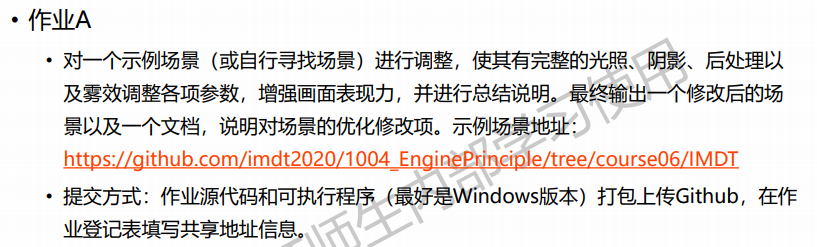
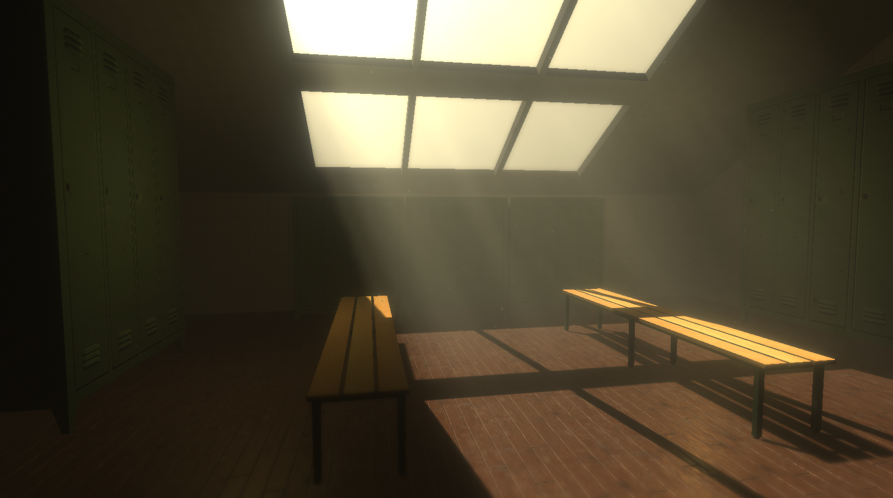

# Task06

作业要求：

作业说明：

- 建立好的场景为工程的../Sences/Homework.unity，具体效果如下所示：

  

- 游戏场景采用了Unity Asset Store 中免费素材：

  - 凳子与衣柜素材：https://assetstore.unity.com/packages/3d/props/interior/locker-room-props-3355
  - 地板贴图：https://assetstore.unity.com/packages/2d/textures-materials/wood/wooden-floor-materials-150564
  - 墙面贴图：https://assetstore.unity.com/packages/2d/textures-materials/concrete/yughues-free-concrete-materials-12951
  - 体积光：https://assetstore.unity.com/packages/tools/particles-effects/aura-volumetric-lighting-111664

- 游戏场景完全由个人搭建，使用了上述的免费素材。主要效果改善：
  - 采用了Aura的资源，用体积光表现出了光照下的丁达尔效应
  - 使用Post Processing插件，进行了一定的视觉效果处理，如光线边缘的模糊、色彩调色、焦段与景深的处理等
  - 使用粒子效果，模拟空气中漂浮的灰尘。