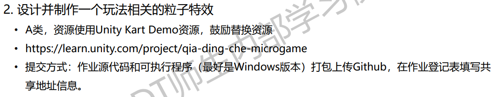
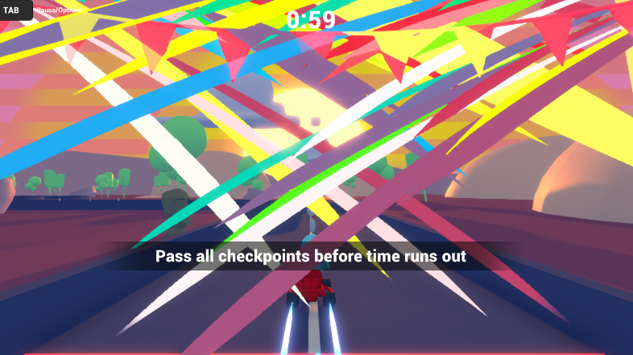
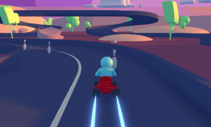
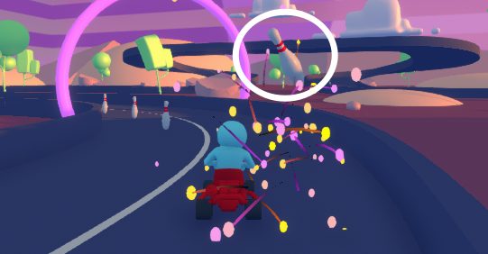
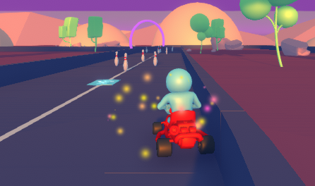

# Task07

作业要求：

作业说明：

- 游戏玩法：在规定时间内，将所有木瓶击倒即可通关。

- 作业资源使用的Unity Kart Demo，原此游戏场景中是无粒子效果的，作业中添加了不同的粒子效果。

  1. 跨越门栏时，喷射礼花

  

  2. 驶过加速板时，赛车速度增加，并轮胎喷射激光效果。

     

  3. 撞到目标物后，播放礼花效果。

     

  4. 与墙面碰撞时，产生火法效果。

     

     

     

