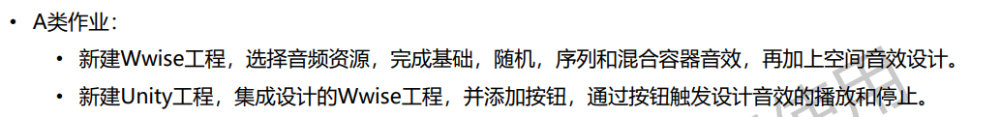
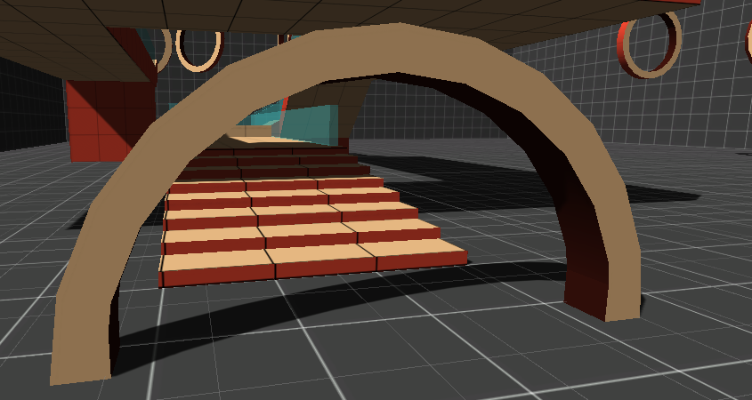

# Task 09

作业要求：

作业说明：

- 作业工程为./AudioDesign，音频资源文件夹为./AudioSourde，可执行程序在./EXE中。作业内容场景为AudioDesign/Assets/IMDT/COURSE/Homework.unity。

- 作业场景采用课程提供的demo为基础(./Assets/IMDT/BASE/Scenes/Main.unity)，在其基础上添加了脚步声的音效。(原demo中无法进行跳跃操作，本次作业中并未修改)

- 当角色以不同速度移动时，其音效与画面同步；

- 当角色在普通地面和建筑地面移动时，其脚步声不同；

  